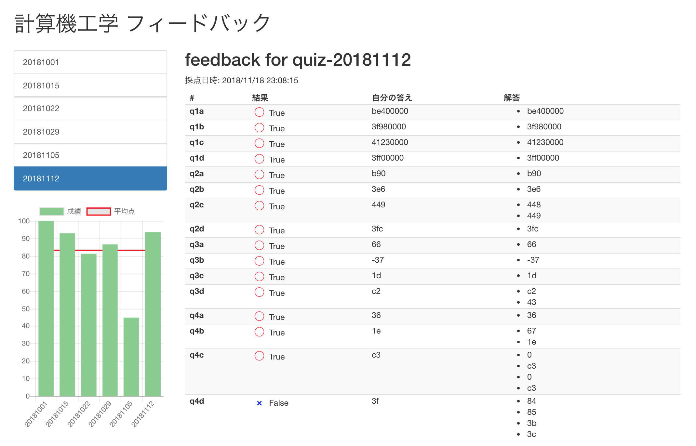
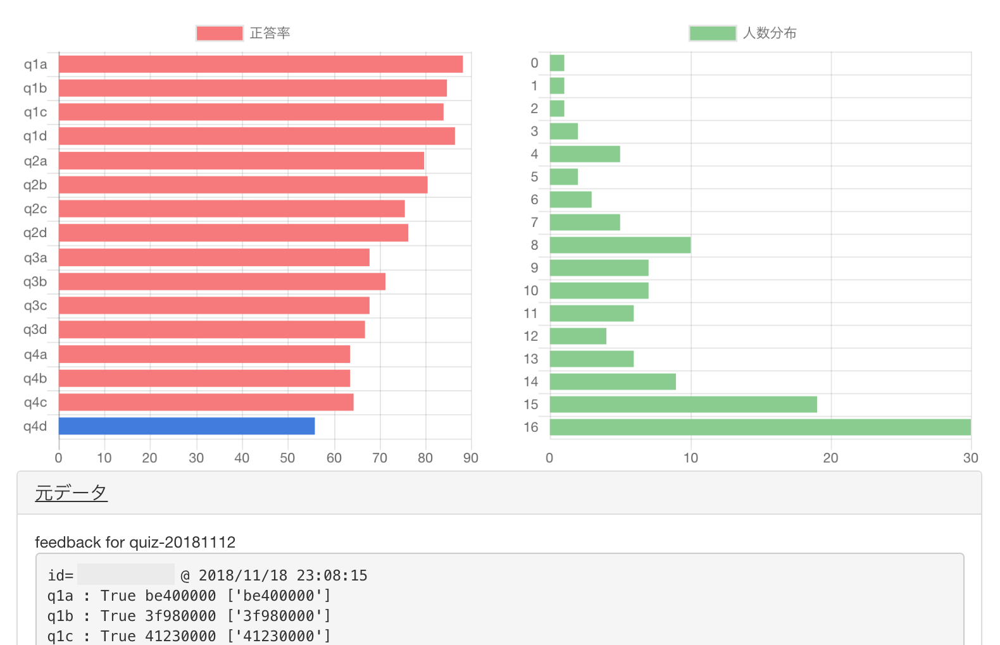

# 組み込み計算機システム フィードバックビューワー

京大の水 1「組み込み計算機システム」で提供されるフィードバックデータを簡単に閲覧できるようにしたプログラムです。


正答率や人数分布、元データについても確認可能です。


## ダウンロード

右上の **「Clone or Download」** を押し、 **「Download ZIP」** をクリック

## 初期設定

**設定ファイルの作成は不要になりました。下の実行方法を参照して、立ち上げるだけで OK です。** もし、毎回個別にパスワードを設定している場合は、下の従来の方法を行ってください。


### JSON ファイルの手動設定

- `settings.sample.json` を `settings.json` にリネーム
- `student_num`と `password` を記入(変換の必要はありません)
- もし個別でパスワードを設定している場合は、以下のような形式で挿入

```
    "password_each": {
        "日付(ex.20181001)": "個別のパスワード"
    },
```

## 実行方法

Python をインストールした環境で、`python main.py`を実行してください。  
実行後、自動で全フィードバックを取得し、ブラウザが開きます。終了するには、 `Ctrl+C`　を押して(exe ファイルを開いた場合はウィドウを閉じて)ください。  
もし、パスワード不備などで取得に失敗したファイルが残った場合、data フォルダ内を削除すれば再取得されます。
